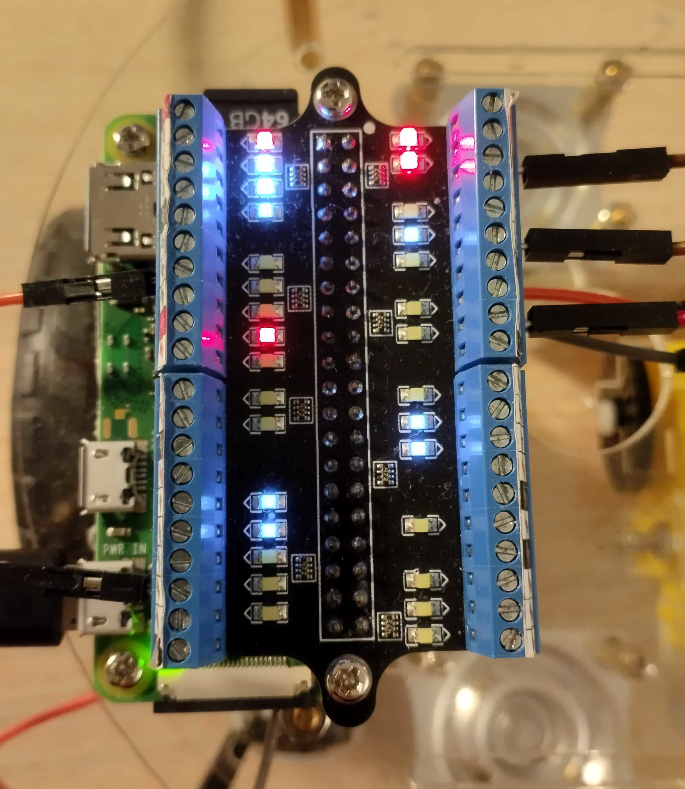
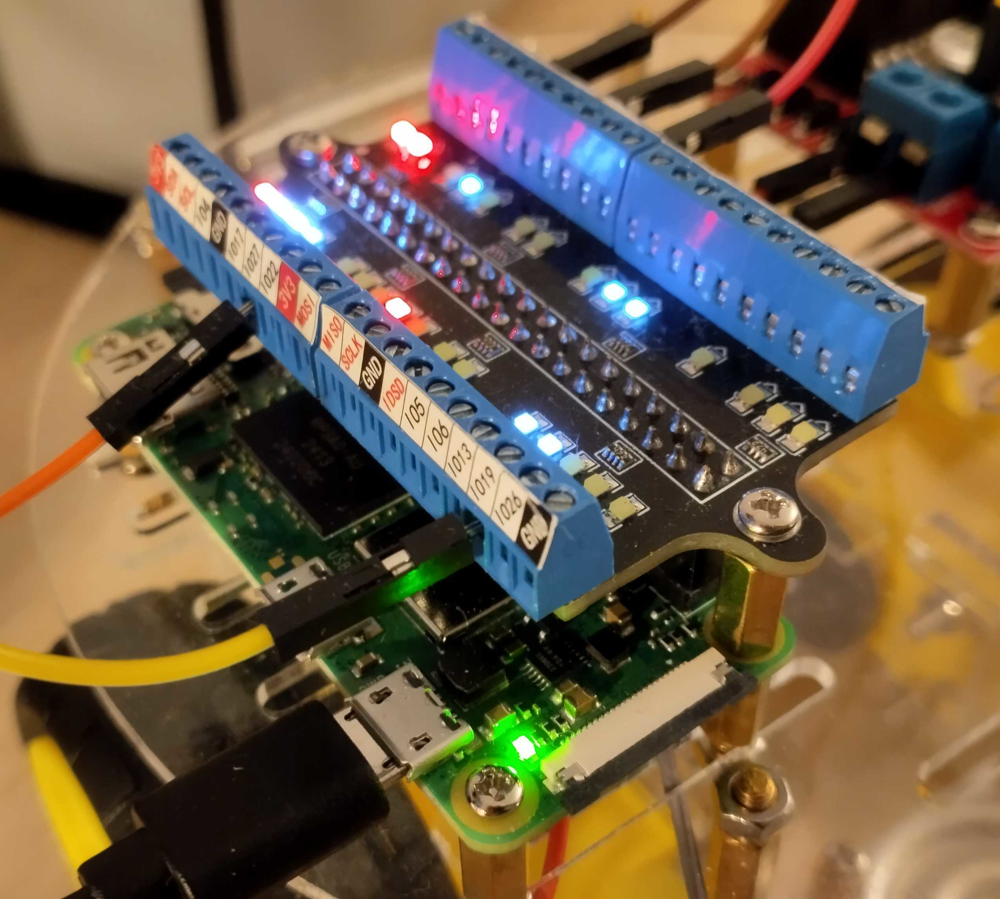
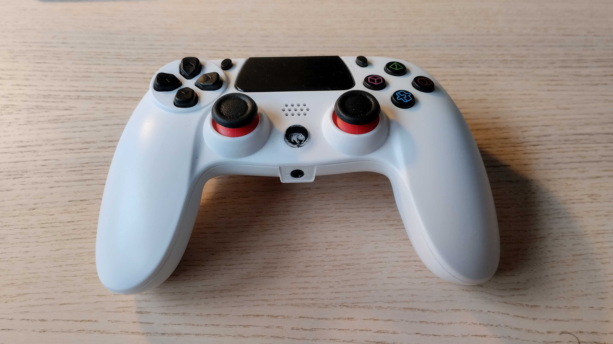
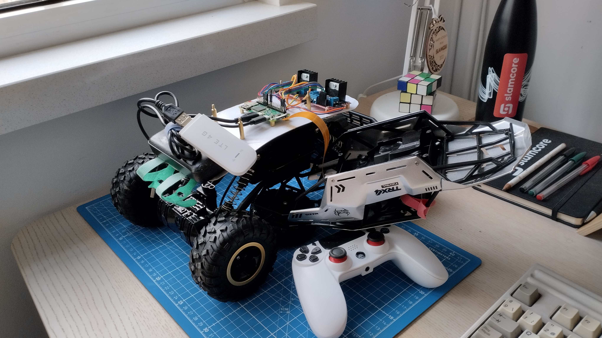

# Zero Programs

A set of small programs targetting the Raspberry Pi Zero (v1 and v2) to learn
about various topics like cross-compilation, robotics, motor drivers and rust.

## Hello GPIO

This initial example shows how to interact with the GPIO interface using rust.
It can be cross-compiled for RPI Zero v2 with the command below:

```
~/.cargo/bin/cross build --target aarch64-unknown-linux-gnu --release
```

The RPI Zero v2 has a quad-core 64-bit ARM Cortex-A53, which implements a
`aarch64` architecture.

Remember that each of the sub-strings in the toolchain name refer to:
 - **arch64**: architecture
 - **unknown**: vendor, *unknown* is typically used for open-source toolchains
 - **linux**: The OS the platform will be running
 - **gnu**: ABI - Application Binary Interface (GNU C Library - `glibc` in this case)

You can simply deploy your cross-compiled binary using `scp`:

```
scp target/aarch64-unknown-linux-gnu/release/hello-gpio zero-v2:~/programs
```

At this point, you are all set up to run the program:

```
./hello-gpio
```

An GPIO hat with LEDs indicators was added to easily observe/debug the outcome
of the program.

<p align="middle">
    &nbsp;&nbsp;
    
</p>

## Interactive Bot

The hardware for this example adds a couple of wheeled motors and a motor driver.

The cross-compilation and deploy workflow is the same as exposed in the previous
example.

It implements a basic shell that allows to send commands to robot. You can
ssh to your RPI Zero v2 and launch shell, then request commands.

```
./interactive-bot
>>> left f
>>> left b
>>> forward
>>> backward
>>> spin l
>>> spin r
...
```

## Event Controller

This is similar to the previous one, but it uses an event polling mechanism
so the robot can be controlled with the keyboard.

https://github.com/user-attachments/assets/28be668c-8902-45d8-b643-d09e0d73ac31

## Fetch Command

In this example, we introduce the desired system architecture, which involves
sending and receiving commands over a network.

This is achieved with two components:

1. **Server**: Runs on a reachable host and serves commands on a specific port.
2. **Client**: Connects to the host to fetch commands from the specified port.

## Raptor Controller

Using a PS4 controller to operate the robot.



## Hello Camera

This small example explores how to read frames from a camera using rust. It
uses rscam, a wrapper for v4l2.

After running the program, `index.html` could be opened in a browser and the
camera feed should be displayed.

Unfortunately, v4l2 gives problems in the RPI platform with the RPI camera,
and a different approach was taken.

## Video Client

This uses a subprocess to run `libcamera-vid` to get frames from the RPI camera,
which seems to work fine.

From now on, we will be working with the RPI Zero v1, so to cross-compile the
binary you should use a different toolchain:

```
~/.cargo/bin/cross build --target arm-unknown-linux-gnueabihf --release
```

And then, after deploying the binary to the RPI, you should be able to run the
program:

```
./video-client <hostname:port>
```

This will try to connect to a server under that hostname and port, and send
video feedback.

A simple server could be started with `netcat` and `ffplay`:

```
nc -lvp <port> | ffplay -
```

## Scout

This concluding program tries to apply the gained knowledge to build a remotely
controlled wheeled robot based on an RC chassis.



The main hardward components are:
 - 2x L298N motor controllers
 - LTE 4G dongle
 - Power Bank
 - Raspberry Pi Zero v1
 - Raspbery Pi Camera module

After using a cardboard for prototyping, a solid plastic base was 3D printed.


The robot functions as a client, retrieving commands and transmitting video
feedback to a designated server. This design choice was primarily influenced by
the limitations of 4G connectivity, which does not easily allow opening ports
for incoming connections. Using this approach, the robot can be operated from a
base station, publishing commands and monitoring the video stream.


*Video at x2*
